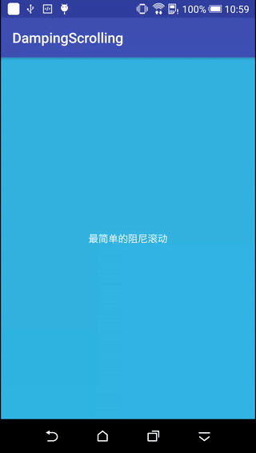
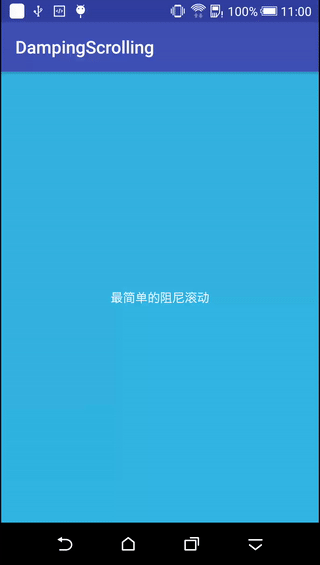
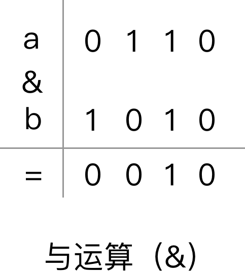
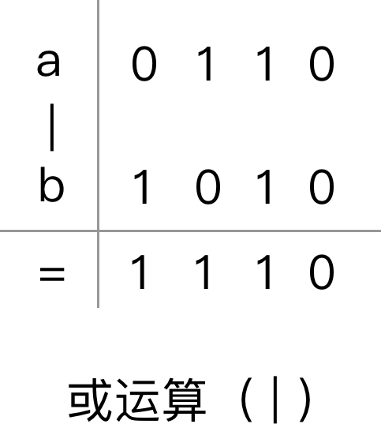

#前言

上海这两天下雨，刚好上周末又碰上双休，宅在家里没有出去，撸了一个阻尼滑动的自定义ViewGroup，加上今天也不是很忙，就赶紧把它撸完啦。

阻尼滚动貌似是iOS原生支持的效果，每次和PM讨论需求时，一碰到阻尼滑动之类的需求时，就说安卓做不了。以后再碰到类似的需求时，就可以跟PM愉快的装逼啦。

照例，先看效果图。


#项目使用
要使用`DampingScrollViewGroup`给你的项目加上阻尼滚动效果，整个过程只需要两个步骤：

1、在项目的`attrs.xml`文件中添加如下属性：

```
    <declare-styleable name="DampingScrollViewGroup">
        <attr name="dampingFactor" format="float" />
        <attr name="dampingDirection">
            <flag name="left" value="0x0001" />
            <flag name="top" value="0x0010" />
            <flag name="right" value="0x0100" />
            <flag name="bottom" value="0x1000" />
        </attr>
    </declare-styleable>
```
 2、在布局文件中引用`DampingScrollViewGroup`，并分别设置`dampingFactor`和`dampingDirection`的值，他们的含义分别如下：
 
 - `dampingFactor`：`阻尼因子`，值越小表示阻力越大，默认为1（即没有阻尼效果）。
 - `dampingDirection`：`阻尼方向`，顾名思义，支持左、上、右、下这4种阻尼方向。

请务必注意，在xml文件中使用`DampingScrollViewGroup`给你的布局添加阻尼效果时，<b>`DampingScrollViewGroup`的直接子View只能有一个！</b>（可以参考ScrollView。）

举个栗子：

`SimpleActivity.java`

```
public class SimpleActivity extends AppCompatActivity {

    @Override
    protected void onCreate(@Nullable Bundle savedInstanceState) {
        super.onCreate(savedInstanceState);
        setContentView(R.layout.activity_simple);
    }

    public void onClick(View view) {
        Toast.makeText(this, "button click", Toast.LENGTH_SHORT).show();
    }
}
```

`activity_simple.xml`

```
<?xml version="1.0" encoding="utf-8"?>
<com.xiaohongshu.dampingscrolling.DampingScrollViewGroup xmlns:android="http://schemas.android.com/apk/res/android"
    xmlns:app="http://schemas.android.com/apk/res-auto"
    android:layout_width="match_parent"
    android:layout_height="match_parent"
    app:dampingDirection="left|top|right|bottom"
    app:dampingFactor="0.7">

    <Button
        android:layout_width="match_parent"
        android:layout_height="match_parent"
        android:background="@android:color/holo_blue_light"
        android:gravity="center"
        android:onClick="onClick"
        android:text="最简单的阻尼滚动"
        android:textColor="@android:color/white" />

</com.xiaohongshu.dampingscrolling.DampingScrollViewGroup>
```

这样，一个非常简单的支持四向阻尼效果的小项目就出来了！看看效果图：


#实现过程
自定义View系列的很多控件都是一点一点的效果加起来，最开始实现一个简单粗糙的逻辑，然后慢慢加上各种优化，最后才变成一个看起来很酷的效果。

而对于这里的`DampingViewGroup`，整个实现过程分为4个部分，包括：

- 1、自定义ViewGroup实现单方向的阻尼
- 2、位运算处理多方向阻尼时的逻辑
- 3、处理滑动冲突，支持常用ViewGroup作为子View时的阻尼效果
- 4、解决Button等作为子View时无法响应点击事件的bug

下面来逐个分析吧。

##自定义ViewGroup实现单方向的阻尼
先来看看阻尼效果发生的场景（嫌啰嗦的可以跳过）：
> 当一个View在某个方向上无法继续滚动时，如果此时用户继续用手指往该方向进行拖动，则此时该View应该发生阻尼效果；当用户手指松开时，该View回弹到发生阻尼效果之前的位置。

比如一个`ScrollView`：

- 初始状态下的`ScrollView`是只能往下滚动的，如果此时用户手指从上往下拖动，则`ScrollView`应当发生顶部方向的阻尼滚动
- 而如果将`ScrollView`滚动到底部之后，用户继续用手指在`ScrollView`上从下往上拖动，则`ScrollView`应当发生底部的阻尼滚动效果

那么如果在`ScrollView`左滑应不应该让它进行阻尼滚动呢？我认为阻尼滚动的效果只是根据用户习惯而产生的一种提升用户体验的需求，`ScrollView`本身就不能左右滑动，如果此时还加一个左右方向的阻尼滚动，这是不合情理的。

（你牛逼你也可以加啊，反正老板打死的是你又不是我。）

我们先来给一个`TextView`来加上顶部方向的滑动阻尼，即如果用户在`TextView`顶部从上往下滑动时，`TextView`的顶部出现阻尼效果。

需求拆分到这种程度，是不是已经非常简单了：重写`ViewGroup`的`onTouchEvent()`方法，并判断当用户手指从上往下拖动时将`ViewGroup`的内容往下移即可。

###onTouchEvent处理滑动效果

来看最简单的自定义ViewGroup的阻尼效果代码：

```
public class DampingScrollViewGroup extends FrameLayout {

    private static final float DEFAULT_FATOR = 1;
    /**
     * 阻尼因子
     */
    private float mFator = DEFAULT_FATOR;
    private Scroller mScroller;
    /**
     * 记录上一次触摸事件
     */
    private MotionEvent mLastMotionEvent;

    public DampingScrollViewGroup(Context context) {
        this(context, null);
    }

    public DampingScrollViewGroup(Context context, AttributeSet attrs) {
        this(context, attrs, 0);
    }

    public DampingScrollViewGroup(Context context, AttributeSet attrs, int defStyleAttr) {
        super(context, attrs, defStyleAttr);
        mScroller = new Scroller(context);
    }

    @Override
    public boolean onTouchEvent(MotionEvent event) {
        super.onTouchEvent(event);

        switch (event.getAction()) {
            case MotionEvent.ACTION_DOWN:
                mLastMotionEvent = MotionEvent.obtain(event);
                break;
            case MotionEvent.ACTION_MOVE:

                int dx = (int) (event.getRawX() - mLastMotionEvent.getRawX());
                int dy = (int) (event.getRawY() - mLastMotionEvent.getRawY());
                if (Math.abs(dx) < Math.abs(dy) && dy > 0) {

                    smoothScrollBy(0, -(int) (dy * mFator));
                }
                mLastMotionEvent = MotionEvent.obtain(event);
                break;
            case MotionEvent.ACTION_UP:
            case MotionEvent.ACTION_CANCEL:

                smoothScrollTo(0, 0);
                break;
        }
        return true;
    }

    private void smoothScrollTo(int fx, int fy) {

        int dx = fx - mScroller.getFinalX();
        int dy = fx - mScroller.getFinalY();
        smoothScrollBy(dx, dy);
    }

    private void smoothScrollBy(int dx, int dy) {

        mScroller.startScroll(mScroller.getFinalX(), mScroller.getFinalY(), dx, dy);
        invalidate();
    }

    @Override
    public void computeScroll() {
        if (mScroller.computeScrollOffset()) {
            scrollTo(mScroller.getCurrX(), mScroller.getCurrY());
            postInvalidate();
        }
        super.computeScroll();
    }
}    
```
布局文件：

```
<?xml version="1.0" encoding="utf-8"?>
<com.xiaohongshu.dampingscrolling.DampingScrollViewGroup xmlns:android="http://schemas.android.com/apk/res/android"
    xmlns:app="http://schemas.android.com/apk/res-auto"
    android:layout_width="match_parent"
    android:layout_height="match_parent">

    <TextView
        android:layout_width="match_parent"
        android:layout_height="match_parent"
        android:background="@android:color/holo_blue_light"
        android:gravity="center"
        android:text="最简单的阻尼滚动"
        android:textColor="@android:color/white" />
</com.xiaohongshu.dampingscrolling.DampingScrollViewGroup>
```

代码很简单，有几点要说一下。

1、首先，`DampingScrollViewGroup`没有选择直接继承`ViewGroup`，而是继承自`FrameLayout`，这就意味着我们不需要去考虑`onMeasure`、`onLayout`、`onDraw`等等的事情，非常省事。

从另一方面讲，对于这个需求，继承自`ViewGroup`也是非常没有必要的。

2、其次，在`onTouchEvent`方法中处理`MotionEvent`等事件时，碰到`MotionEvent.ACTION_DOWN`时一定要记得返回true，否则就无法收到后面的一系列`MotionEvent`事件了。

3、保存上一次触摸事件的`MotionEvent`对象时，一定要用`MotionEvent.obtain(event)`的方式来获取它的拷贝，而不是直接用`等于号(=)`来保存它的引用。
 
 因为在一次完整的触摸过程中（`ACTION_DOWN` -> `ACTION_MOVE` -> ... -> `ACTION_UP`），`onTouchEvent`方法的形参始终都是同一个`MotionEvent`对象，如果用`等于号(=)`来保存上一次触摸的引用的话，做位移运算(`event.getRawX() - mLastMotionEvent.getRawX()`)时就会出错。
 
4、在`ACTION_UP`或者`ACTION_CANCEL`时，记得使`ViewGroup`回到初始位置。

5、为了使滑动平滑连贯，使用`Scroller`进行滚动，关于`Scroller`的用法这里不再赘述。

6、为了产生阻尼效果，代码第41行让`ViewGroup`滚动的时候让`dy`乘以了一个系数`mFactor`，将`mFactor`的值设置在`(0,1]`的区间就可以使滚动产生阻尼效果了。



###灵活配置阻尼因子

我们叫这个`mFactor`为`阻尼因子`，`阻尼因子`默认的值为1，所以`ViewGroup`滚动时没有阻尼效果。想产生阻尼效果很简单，直接修改`阻尼因子`的值即可，可是怎样使`阻尼因子`可以动态配置呢？类似于给`TextView`配置`text`、给`ImageView`配置`src`。。

我们在`res`文件夹新建一个`attrs.xml`文件，这个文件可以存放自定义控件的各种属性，属性一旦定义好就可以在布局文件中进行引用啦。

比如我们要给`DampingScrollViewGroup`添加一个`阻尼因子`的属性，可以这样定义：

```
    <declare-styleable name="DampingScrollViewGroup">
        <attr name="dampingFactor" format="float" />
    </declare-styleable>
```
`declare-styleable`即表示一组自定义属性的集合，`name`后面跟自定义控件的名字。

`declare-styleable`里面就是填写各种自定义属性的地方，我们这里暂时只定义`阻尼因子`，所以定义一个属性`dampingFactor`，属性对应的值的类型是`float`。

这样，自定义属性就定义好了，快去布局文件中引用吧。

完整的布局文件代码如下：

```
<?xml version="1.0" encoding="utf-8"?>
<com.xiaohongshu.dampingscrolling.DampingScrollViewGroup xmlns:android="http://schemas.android.com/apk/res/android"
    xmlns:app="http://schemas.android.com/apk/res-auto"
    android:layout_width="match_parent"
    android:layout_height="match_parent"
    app:dampingFactor="0.7">

    <TextView
        android:layout_width="match_parent"
        android:layout_height="match_parent"
        android:background="@android:color/holo_blue_light"
        android:gravity="center"
        android:text="最简单的阻尼滚动"
        android:textColor="@android:color/white" />

</com.xiaohongshu.dampingscrolling.DampingScrollViewGroup>
```

代码第3行，<b>在自定义控件或自定义控件的父控件的属性中</b>引用命名空间，然后就可以引用自定义属性了。

第6行，引用自定义属性，并给其赋值。

好了，自定义属性的配置就到这里了，怎么在代码中获取并引用呢？

在`DampingScrollViewGroup`的构造方法中添加如下代码：

```
    public DampingScrollViewGroup(Context context, AttributeSet attrs, int defStyleAttr) {
        super(context, attrs, defStyleAttr);

        TypedArray a = context.obtainStyledAttributes(attrs,
                R.styleable.DampingScrollViewGroup, defStyleAttr, 0);
        int count = a.getIndexCount();
        for (int i = 0; i < count; i++) {
            int index = a.getIndex(i);
            switch (index) {
                case R.styleable.DampingScrollViewGroup_dampingFactor:
                    mFator = a.getFloat(index, DEFAULT_FATOR);
                    break;
            }
        }
        a.recycle();

        mScroller = new Scroller(context);
    }
```
代码第4~5行，将`AttributeSet`按照我们先前定义的自定义属性的格式解析成我们需要的`TypedArray`对象。

第6~14行，遍历所有的属性，并取出其中的值。由于之前定义`dampingFactor`属性的时候定义值的类型是`float`，所以这里用`TypedArray.getFloat()`来获取。

第15行，回收该`TypedArray`对象。

至此，自定义属性的代码获取也写好啦。`阻尼因子`值为`0.7`时的效果图如下：



##位运算处理多方向阻尼时的逻辑
单方向的阻尼效果已经处理好了，现在来增加对其余3个方向的支持，所以我们在`attrs.xml`文件中新增一个自定义属性`dampingDirection`，用来表示`阻尼方向`。

`阻尼方向`可以有4个，为什么用一个自定义属性就可以实现了呢？回想一下，我们平常开发中哪些控件只用一个自定义属性就可以支持多种状态的。

比如：

- `Activity`在`AndroidMainfest.xml`文件中注册时的`windowSoftInputMode`
- `EditText`的`inputType`、`imeOptions`
- `TextView`的`autoLink`
- `View`的`gravity`和`layout_gravity`
- ··· 等等

我们以`TextView`的`autoLink`来举例，当在布局文件中给`TextView`的`autoLink`设置了下列值当中的一种时，当`TextView`中的字符串符合该值相对应的正则表达式时，则会提供自动高亮和点击的功能。

- `none `: 什么都不匹配
- `web `: 匹配网页地址
- `email `: 匹配邮件地址
- `phone `: 匹配电话号码
- `map `: 匹配居住地址
- `all `: 匹配全部，相当于`web|email|phone|map`，即匹配所有的网页地址、邮件地址、电话号码、居住地址

当然这几种之间也可以随意搭配，比如`web|email`、`web|phone|map`、`email|phone|map`，等等。他们是怎么做到可以同时存在，不会彼此影响或者覆盖彼此的设置呢？

为了明白`autoLink`的工作原理，我们先来看看它的定义方式，我们在`sdk\platforms\android-23\data\res\values\`路径下找到了Android自带的`attrs.xml`文件。

搜索`autoLink `，在`attrs.xml`文件中第1459~1475行有如下代码：

```
    <!-- Controls whether links such as urls and email addresses are
         automatically found and converted to clickable links.  The default
         value is "none", disabling this feature. -->
    <attr name="autoLink">
        <!-- Match no patterns (default). -->
        <flag name="none" value="0x00" />
        <!-- Match Web URLs. -->
        <flag name="web" value="0x01" />
        <!-- Match email addresses. -->
        <flag name="email" value="0x02" />
        <!-- Match phone numbers. -->
        <flag name="phone" value="0x04" />
        <!-- Match map addresses. -->
        <flag name="map" value="0x08" />
        <!-- Match all patterns (equivalent to web|email|phone|map). -->
        <flag name="all" value="0x0f" />
    </attr>
```
上面我们定义`阻尼因子`时，使用的定义方式如下：

```
        <attr name="dampingFactor" format="float" />
```
这种方式定义出来的属性在xml中只能有一个固定的值，而如果要同时支持多个值以表示多种状态，则需要对自定义属性的值进行约束和声明。比如这样：

```
<attr name="属性名">
        <flag name="属性值a" value="属性值a的标识" />
        <flag name="属性值b" value="属性值b的标识" />
</attr>
```
这样，就可以在布局文件中用`属性值a|属性值b`来使`属性值a`和`属性值b`同时生效了。

顺便提一下，这里是个属性值指定类型为`flag`，除此之外，可以指定为`enum`，比如`LinearLayout`的`orientation `的值：

```
    <attr name="orientation">
        <!-- Defines an horizontal widget. -->
        <enum name="horizontal" value="0" />
        <!-- Defines a vertical widget. -->
        <enum name="vertical" value="1" />
    </attr>
```
`flag`和`enum `有什么区别呢？结合我们平时的使用方式，答案一目了然：<b>用`flag`声明的属性值可以同时存在，彼此互不干扰；用'enum'声明的值则相互排斥，只能存在一种。</b>

扯远了，回到正题。刚才说到将属性值的类型声明为`flag`之后，在布局文件中就可以给一个属性同时设置多种属性值了，但是它们怎么做到同时生效而且又互不干扰呢？

这就要复习一下位运算了。

位运算即基于二进制位的计算，包含几种种基本的运算：<b>按位与、按位或、按位异或、按位取反、左移、带符号右移、无符号右移</b>。我们这里主要用到<b>`与运算`</b>和<b>`或运算`</b>，所以主要讲这两个，想对位运算了解的更多的同学可以百度，或者去看我的这篇文章[位运算，安卓源码里的各种Flag](http://blog.csdn.net/aishang5wpj/article/details/49583899)。

先来看看`与运算`和`或运算`的计算方法。

###与运算
符号：&

描述：相同位的两个数字都为1，则为1；若有一个不为1，则为0。

举例：a=0110，b=1100，则a&b的计算结果如下，



###或运算
符号：|

描述：相同位只要一个为1即为1。

举例：a=0110，b=1100，则a|b的计算结果如下，



好了，基本的运算复习到这里，我们再回头看看`autoLink`的设置方式。

|属性值  |属性值的值| 属性值对应的二进制|
| ----  |:------:| --------------:| 
| none  | 0x00   |            0000|
| web   | 0x01   |            0001|
| email | 0x02   |            0010|
| phone | 0x04   |            0100|
| map   | 0x08   |            1000|
| all   | 0x0f   |            1111|

表格中是`autoLink`属性对应的各种值，假设我们用`mAutoLinkFlags`来保存`TextView`的各种值，并且初始状态为0：

假设我们在布局文件中设置`autoLink`的属性值为`web | email`，则根据<b>或运算</b>的计算方式，可以得到`mAutoLinkFlags`= 0011。

那我们在代码中怎么知道`mAutoLinkFlags`有没有设置`web`或者`email`呢？根据<b>与运算</b>的计算原理，我们可以用公式:

`mAutoLinkFlags & flag == flag`

来判断`mAutoLinkFlags `中有没有设置`flag`的值。

比如我们要判断有没有设置`web`，则用`mAutoLinkFlags & web == web `来判断，即`0011 & 0001 == 0001`，很显然，这个等式是成立的。

比如我们要判断有没有设置`phone `，则用`mAutoLinkFlags & phone == phone `来判断，即`0011 & 0100 == 0100`，左边算出来的值是0，等式不成立，所以`mAutoLinkFlags`中是没有设置`phone `属性的。

<b>我们通常用一个int类型的值来存储所有的flags，每种flag在该值中占据1个`bit`的位置，并用该`bit`上的值为1或0来表示flag对应的两种状态。</b>

我们知道，`int类型`在Java中占据4个`Byte`，每个`Byte`有8个`bit`，一共有32个`bit`。所以理想情况下一个`int类型`的变量最多可以存放多大32种不同的flags，并且他们可以同时生效互不干扰。

如果不这么做，你可能需要用32个布尔变量来存放所有的属性值。。

当然，各种属性值的取值也不是随便取的，必须保证他们的值转成二进制之后“只能占据一个`bit`的位置”，所以你看`autoLink`属性对应的各种值，他们转成二进制之后都只占据一个`bit`的位置，比如`0001`、`0010`、`0100`，而不存在`0011`这种值存在，如果这样的话就会对其他的属性值的判断产生干扰了。。

回想Android中的很多源码里面，都用这种方式来标志对象的各种属性和状态的，想对位运算了解的更多的同学可以百度，或者去看我的这篇文章[位运算，安卓源码里的各种Flag](http://blog.csdn.net/aishang5wpj/article/details/49583899)。

讲位运算讲了这么多好像很无聊，接下来讲`DampingScrollViewGroup`代码里实现多方向阻尼的时候要注意的一些地方。

首先，手指移动时，要判断滚动方向是水平方向还是垂直方向，然后分别处理对应方向的阻尼效果。

其次，在一次触摸过程中，只能存在一个方向上的阻尼效果。比如用户设置了4个方向的阻尼效果，当顶部产生了阻尼效果之后如果用户此时手指水平滚动，那水平反向就不能产生阻尼效果，直到下一次用户手指按下时再做判断。

至此，位运算处理多方向阻尼时的逻辑就讲到这里了。

##处理滑动冲突，支持常用ViewGroup作为子View时的阻尼效果


##解决Button等作为子View时无法响应点击事件的bug
 
关于
--

博客：[http://blog.csdn.net/aishang5wpj](http://blog.csdn.net/aishang5wpj)

邮箱：337487365@qq.com

License
--
Copyright 2017 aishang5wpj

Licensed under the Apache License, Version 2.0 (the "License"); you may not use this file except in compliance with the License. You may obtain a copy of the License at

http://www.apache.org/licenses/LICENSE-2.0

Unless required by applicable law or agreed to in writing, software distributed under the License is distributed on an "AS IS" BASIS, WITHOUT WARRANTIES OR CONDITIONS OF ANY KIND, either express or implied. See the License for the specific language governing permissions and limitations under the License.