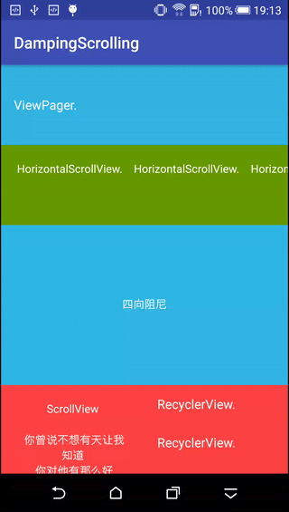

#前言

上海这两天下雨，刚好上周末又碰上双休，宅在家里没有出去，撸了一个阻尼滑动的自定义ViewGroup，加上今天也不是很忙，就赶紧把它撸完啦。

阻尼滚动貌似是iOS原生支持的效果，每次和PM讨论需求时，一碰到阻尼滑动之类的需求时，就说安卓做不了。以后再碰到类似的需求时，就可以跟PM愉快的装逼啦。

照例，先看效果图。

#项目使用

#实现过程

 
关于
--

博客：[http://blog.csdn.net/aishang5wpj](http://blog.csdn.net/aishang5wpj)

邮箱：337487365@qq.com

License
--
Copyright 2017 aishang5wpj

Licensed under the Apache License, Version 2.0 (the "License"); you may not use this file except in compliance with the License. You may obtain a copy of the License at

http://www.apache.org/licenses/LICENSE-2.0

Unless required by applicable law or agreed to in writing, software distributed under the License is distributed on an "AS IS" BASIS, WITHOUT WARRANTIES OR CONDITIONS OF ANY KIND, either express or implied. See the License for the specific language governing permissions and limitations under the License.